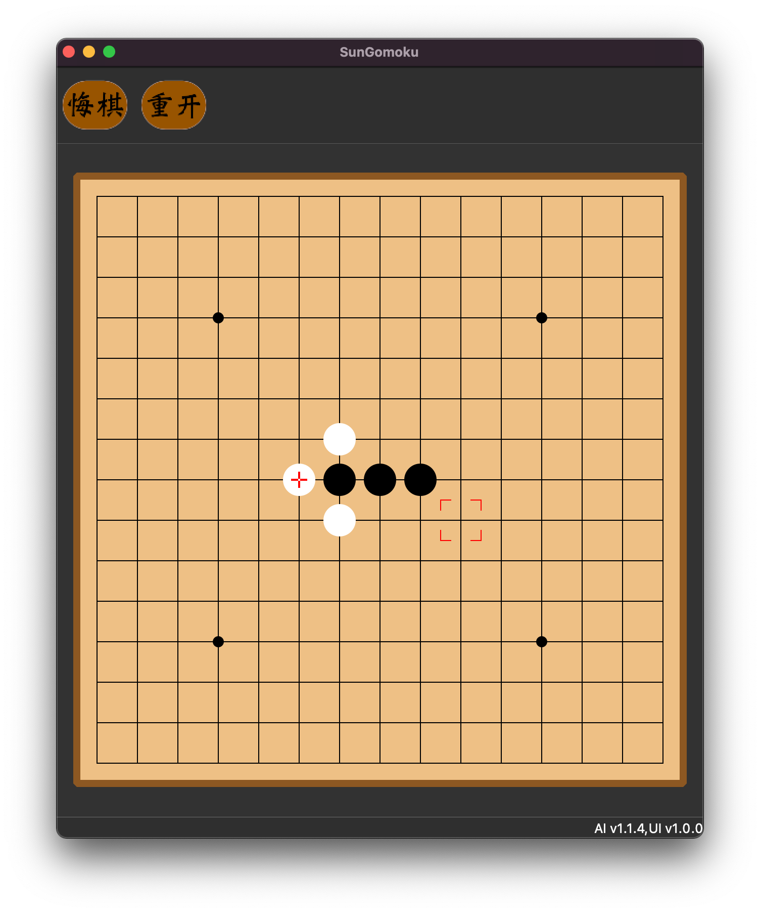

# PentaZen Desktop

This is a gomoku/renju program developed by [Sun](https://github.com/sun-yuliang) and [Xiaorong Wang](https://github.com/alien-wxr). The engine part is written by **Sun** using C and the UI part is written by **Xiaorong Wang** using C++.

The [Github-page](https://alien-wxr.github.io/PentaZen_Qt/) of the repo.

## Engine

The engine supports both gomoku and renju rules. The gomoku rule doesn't require winning in exact five discs in a row. The renju rule doesn't support any kind of changes. The searching algorithm is minimax search with alpha-beta pruning. The evaluation method is using pre-generated tables. Search depth is ensured to be greater than or equal to 10 moves. Search time for one move is set to be less than 3 seconds.

## UI

The UI is developed using Qt. It is artistic and cross-platform.

The current UI is based on Qt5.12.

### Hall

### Room

## Todo

1. Change into the next generation [PentaZen Engine](https://github.com/sun-yuliang/PentaZen).

## Author

- [Xiaorong Wang](https://github.com/alien-wxr)
- [Sun](https://github.com/sun-yuliang) (Engine provider)
